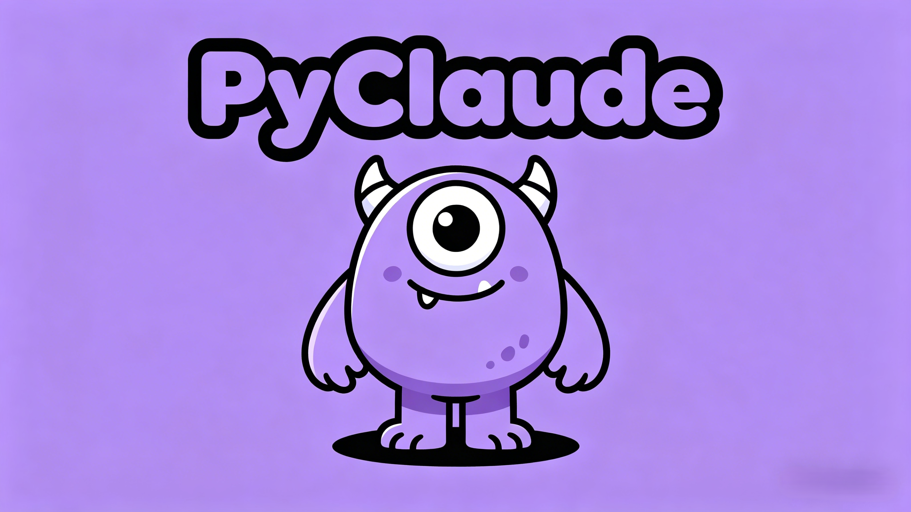

# PyClaude多会话智能助手系统
&emsp;&emsp;
### PyClaude是什么？
*借鉴Claude Code的框架设计思路*<br>
*一个基于 FastAPI + ReAct 架构 的多用户、多会话、可视化智能 Agent 系统，支持工具调用、上下文管理、长期记忆、会话隔离、前端可视化交互。*

| 模块    | 完成 | 未完成         |
|-------|---|-------------|
| 记忆系统  | ✅ |             |
| 上下文管理 | ✅ |             |
| 渐进式加载 | ✅ |             |
| queryEngine | ✅ |             |
| 权限管理  | ✅ |             |
| 子Agent | ✅ sub agent | ❌agent team |
| 提示词分区 | ✅ |             |
| 个人知识库 | ✅ |             |


## 项目结构
```
claude_agent/
├── main.py                     # 项目入口
├── config.py                   # 全局配置
├── model/                      # LLM接口
├── .Pyclaude/
│   └── PyClaude.md             # 系统提示词
├── core/                       # 核心大脑
│   ├── query_engine.py         # ReAct 执行引擎
│   ├── agent_loop.py           # Agent 主循环封装
│   └── context_manager.py      # 上下文管理
├── tools/                      # 工具模块
│   ├── base_tool.py            # 统一工具基类
│   ├── lazy_tool/              # 延迟工具
│   └── core_tools/             # 核心工具
├── security/                   # 安全体系
│   ├── path_validator.py       # 路径安全校验
│   ├── audit_logger.py         # 拒绝日志
│   ├── command_whitelist.py    # 命令白名单
│   └── semantic_analyzer.py    # 命令语义危险分析
├── memory/                     # 双层记忆模块
│   ├── auto_memory.py          # 长期记忆（跨会话）
│   └── session_memory.py       # 会话记忆
├── mcp/                        # MCP服务
│   ├── client.py               # CMP客户端
│   └── tools.py                # MCP披露工具
├── prompt/                     # 提示词构建
│   ├── static_prompt.py        # 静态系统提示
│   ├── dynamic_prompt.py       # 动态上下文
│   ├── user_profile.py         # 用户画像（自定义md）
│   └── prompt_builder.py       # 最终提示词拼接
├── rag/                        # 个人知识库
├── multi_agent/                # 子Agent框架
├── api/                        # FastAPI 接口
├── manager/                    # 多用户/多会话管理
└── frontend/                   # 可视化前端页面

├── storage/                    # 外部目录：持久化存储（用户/会话/记忆/文件）
```

## 实现细节
1. 📂 上下文管理：使用四层压缩框架
   * Tool Result Budge
   * Microcompac
   * Auto Compac
   * Blocking Limit
2. 🧠 记忆系统
    * Auto Memory: 长期跨会话以及
    * Session Memory: 会话记忆
    * Active Recall: 扫描 -> 摘要 -> 选择 -> 后校验 -> 注入
3. 🛠️ 工具系统
    * 核心工具: 作为System Prompt必须加载
    * 延迟工具: 由Agent决定是否加载
4. 💻 MCP: 可自定义配置MCP服务
5. 🤖 SKILL: 可自定义配置SKILL
6. 📄 提示词
    * 静态区: 包括PyClaude.md、工具信息、skill摘要
    * 动态区：包括环境信息、MCP、MEMORY.md、长期记忆、上下文
7. 🔒 权限系统：路径校验、工具校验、human-in-loop
8. 📂 个人知识库：支持创建和管理个人知识库，并使用RAG进行检索

## ⚡快速开始⚡
### 1. Web端
安装依赖
```
pip install fastapi uvicorn pydantic
```

Web 启动
```
python -m claude_agent.main
```

### 2. CLI 命令行
```
python -m claude_agent.core.agent_loop
```

---

## 个人知识库(2026.5.15新增)
详见`rag\README.md`
